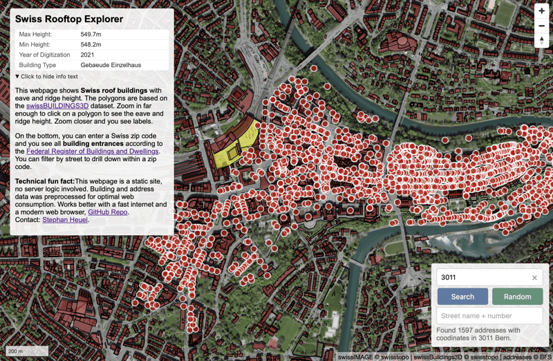

# Swiss Rooftop Explorer

A web application for exploring Swiss rooftops and addresses. 

**[See it live in action](https://ping13.net/swiss-rooftop-explorer/)**



Read all about it in this [blog-post](https://blog.heuel.org/2025/02/swiss-roof-explorer/).

## Features

- Fast web map for approximately 3.2 million roof polygons in Switzerland,
  using [PMTiles][]
- End-to-end data processing pipeline from a FileGeodatabase to PMTiles via
  [Geoparquet][]
- Swiss addresses stored in a compact parquet file for quick retrieval
- Client-side querying of addresses using [DuckDB-WASM][]
- No server component needed other than a web or object server, making it easy
  to run locally
- Bookmarking is possible, for example in Bern:
  <https://ping13.net/swiss-rooftop-explorer/?zip=3011> (though it may take a
  couple of seconds until the app zooms to the area of interest)

## Prerequisites

- Python 3.11+
- Node.js
- Make
- DuckDB
- Tippecanoe (for PMTiles generation)
- Conda/Mamba (for environment management)

## Installation

1. Clone the repository:
```bash
git clone https://github.com/ping13/swiss-rooftop-explorer
```

2. Install dependencies and initialize the conda environment, on a Mac:

```bash
brew install miniforge
mamba create -n myenv 
source init.sh ## This includes activating the `myenv` environment
mamba install gdal geopandas pyarrow tqdm psutil libgdal-arrow-parquet pyvista
trimesh click httpx hishel rtree duckdb
pip install manifold3d
source init.sh
```

3. Install frontend dependencies:
```bash
cd web
npm install
```

## Data Processing Pipeline

The project processes Swiss geographic data through several stages:

### 1. Data Download
```bash
make download
```
Downloads and extracts:
- Swiss address database (SQLite format)
- SwissBUILDINGS3D 3.0 data (FileGDB format)

### 2. Address Data Processing
```bash
make create_addresses
```
Converts Swiss address data from SQLite to two Parquet formats:
- Full dataset (`addresses_full.parquet`)
- Minimal dataset (`addresses.parquet`)

### 3. Building Data Processing
```bash
make create_buildings
```
Processes building data through multiple stages:
- Converts FileGDB to Parquet
- Processes 3D geometries
- Creates 2D projections

### 4. Map Tile Generation
```bash
make pmtiles
```
Generates PMTiles for web visualization:
- `roofs.pmtiles`: Complete dataset
- `roofs-small.pmtiles`: Smaller test dataset

## Development

Start the development server:
```bash
make devserver
```

Build for production:
```bash
make build_web
```

Test production build:
```bash
make test_web
```


## Project Structure

```
├── scripts/                   # Data processing scripts
│   ├── addresses_sqlite2pq.py
│   ├── swissbuildings3D_gdb2pq.py
│   ├── swissbuildings3D_process.py
│   └── pq2pmtiles.sh
├── web/                       # Web application
│   ├── src/
│   ├── public/
│   └── package.json
├── Makefile                   # Build automation
├── init.sh                    # Environment setup
└── pyproject.toml             # Python project configuration
```

## Technology Stack

- Frontend: 
  - Vanilla JavaScript
  - Vite for build tooling
  - DuckDB-WASM for client-side querying
  - MapLibre GL for map visualization
- Data Storage:
  - Parquet format for efficient data storage
  - PMTiles for map visualization
- Data Processing:
  - Python with GeoPandas, PyArrow
  - DuckDB for SQL operations
  - GDAL/OGR for geographic data processing
- Build System: Make

## Known issues

- Sometimes, the geometry of roofs may look weird when zoomed in.
- The webmap may be hard to run on small machines


